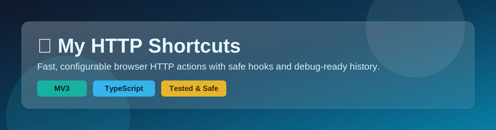

# ⚡ My HTTP Shortcuts



[](https://github.com/dmoliveira/my_http_shortcuts/actions/workflows/ci.yml)
[](https://github.com/dmoliveira/my_http_shortcuts/actions/workflows/pages.yml)
[](LICENSE)
[](https://github.com/dmoliveira/my_http_shortcuts/releases)
[](https://github.com/dmoliveira/my_http_shortcuts/commits/main)
[](https://github.com/dmoliveira/my_http_shortcuts/issues)
[](https://github.com/dmoliveira/my_http_shortcuts/stargazers)
[](https://buy.stripe.com/8x200i8bSgVe3Vl3g8bfO00)

A lean Chrome extension to run configurable HTTP shortcuts from the browser, with input preprocessing and response postprocessing.

Quick navigation: [Project Index](#-project-index) · [Highlights](#-highlights) · [Quickstart](#-quickstart) · [Architecture](#-architecture) · [Quality Commands](#-quality-commands) · [Security & Privacy](#-security--privacy) · [Releases](#-releases) · [Support](#-support-this-project)

## 🗂️ Project Index

- Getting started: `docs/getting-started.md`
- Full docs map: `docs/index.md`
- GitHub Pages docs (after first pages deploy): `https://dmoliveira.github.io/my_http_shortcuts/`
- Debugging guide: `docs/runbooks/debugging.md`
- Extension smoke tests: `docs/runbooks/extension-smoke-test.md`
- Release process: `docs/runbooks/release.md`
- Support and donations: `docs/support-the-project.md`
- Hero image generation guide: `docs/assets/hero-image-generation.md`

## ✨ Highlights

- **⚙️ Core execution**
  - 🧩 Shortcut-based request execution with optional pre/post script hooks
  - 🧠 Variable templates with prompts (`{{name}}`) and selected-text context capture
  - 🎯 Configurable default shortcut for context-menu runs

- **🧪 Safety and reliability**
  - 🛡️ Fail-fast URL/headers/runtime-message validation and robust error mapping
  - 🧯 Script hooks enforce safe output contracts (pre: string map, post: string)
  - 🔄 Timeout/network retry seed with deterministic error handling

- **🧭 Debuggability and UX**
  - 🟢 Popup run status feedback, one-click copy, and structured response rendering
  - 🕘 Popup and options history views with source tagging and correlation IDs
  - 📊 Live history stats (success rate, avg/max duration) with practical filter controls

- **📦 Portability and quality**
  - 📦 JSON import/export with schema migration support
  - 🧪 Test-first modules with lint/typecheck/test/build workflow
  - 🧰 Release/check tooling and smoke-test runbooks included

## 🚀 Quickstart

Need a simple step-by-step install and usage path? Start with `docs/getting-started.md`.

1. Install dependencies:

```bash
make install
```

2. Build extension:

```bash
make build
```

3. Load unpacked extension:
- open `chrome://extensions`
- enable Developer mode
- click "Load unpacked"
- select `dist/`

## 🏗️ Architecture

- `src/background`: orchestration and execution pipeline
- `src/options`: shortcut management UI
- `src/popup`: run shortcuts quickly
- `src/domain`: core models and template resolver
- `src/utils`: logging, io, networking, validation helpers
- `src/config`: constants and defaults

## 🧪 Quality Commands

```bash
make dependency-security-report
make dependency-unblock-packet
make gate-status
make validate-local
make release-ready
```

## 🔐 Security & Privacy

- data is local-first (`chrome.storage.local`)
- logs/history are sanitized
- network requests are timeout-bounded
- script hooks are explicitly scoped and validated

## 📦 Releases

- release process guide: `docs/runbooks/release.md`
- dependency gate unblock guide: `docs/runbooks/dependency-gate.md`
- manual extension smoke checklist: `docs/runbooks/extension-smoke-test.md`
- draft notes command: `make release-notes`
- draft notes file: `make release-notes-file` -> `docs/release-notes-draft.md`
- metadata check command: `make release-check`
- metadata smoke command: `make release-check-smoke`

## 💛 Support This Project

- Donate directly via Stripe: https://buy.stripe.com/8x200i8bSgVe3Vl3g8bfO00
- Support page: `docs/support-the-project.md`
- Every contribution helps keep maintenance and feature delivery moving.

## 🤝 Contributing

Use feature branches and open PRs with testing notes. Keep changes small and focused.

## 📄 License

MIT — see `LICENSE`.
